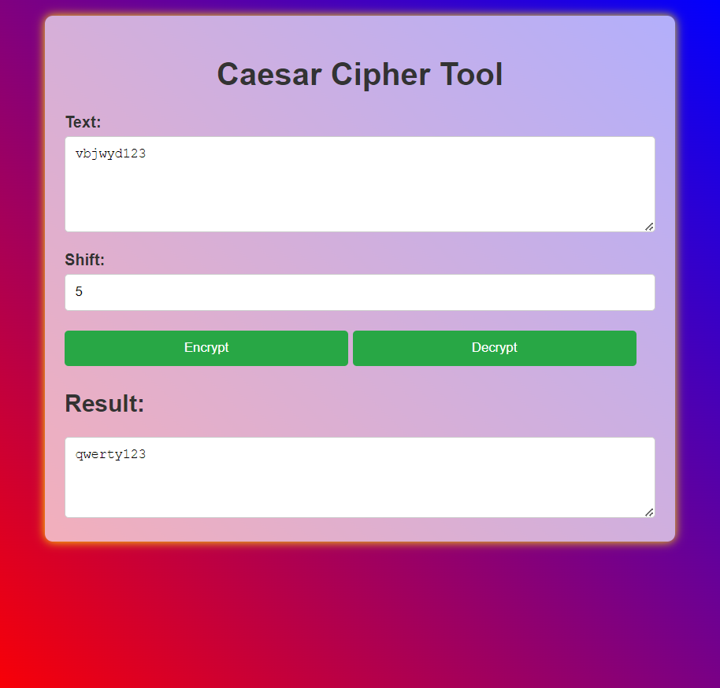

# Caesar Cipher Tool

A simple web-based application that allows users to encrypt and decrypt text using the Caesar Cipher technique. This tool shifts each letter in the input text by a specified number of places in the alphabet.

## Features

- Encrypt text using the Caesar Cipher method.
- Decrypt previously encrypted text.
- Adjustable shift value for flexibility.

## Technologies Used

- HTML5
- CSS3
- JavaScript

## Installation

1. **Clone the repository**:
   ```bash
   git clone https://github.com/Arpan-Saha-25/Web-Dev.git

2. **Open the HTML file**:
Navigate to the cloned directory and open caesar_enc_dec.html in your web browser.

## Usage

1. Enter the text you want to encrypt or decrypt in the text area.
2. Specify the shift value (default is 3).
3. Click the **Encrypt** button to encrypt the text or the **Decrypt** button to decrypt it.
4. The result will be displayed in the output text area.

## Code Overview

### JavaScript Functions

- **`encrypt(str, key)`**: 
  - Takes a string (`str`) and a numeric key (`key`).
  - Returns the encrypted string by shifting each letter by the key value.
  - Non-letter characters remain unchanged.

- **`decrypt(str, key)`**: 
  - Takes a string (`str`) and a numeric key (`key`).
  - Returns the decrypted string by shifting each letter back by the key value.
  - Non-letter characters remain unchanged.

### Event Listeners

- The tool adds event listeners to the **Encrypt** and **Decrypt** buttons, triggering the respective functions and updating the output area with the results.

### CSS Styles

The CSS file (`caesar_enc_dec.css`) provides a clean and modern look for the application. Key styles include:

- **Background**: A gradient from red to blue with fixed attachment.
- **Container**: A white, semi-transparent box with rounded corners and a shadow effect for focus.
- **Buttons**: Styled with a green background that darkens on hover, ensuring a responsive design.
- **Text Areas**: Full width for easy text input and output.

## License

This project is open-source.

## Contributing

Feel free to fork the repository and submit pull requests for any improvements or additional features.

## Acknowledgments

- Inspired by classical encryption techniques.
- Done as a project for college assignment.

